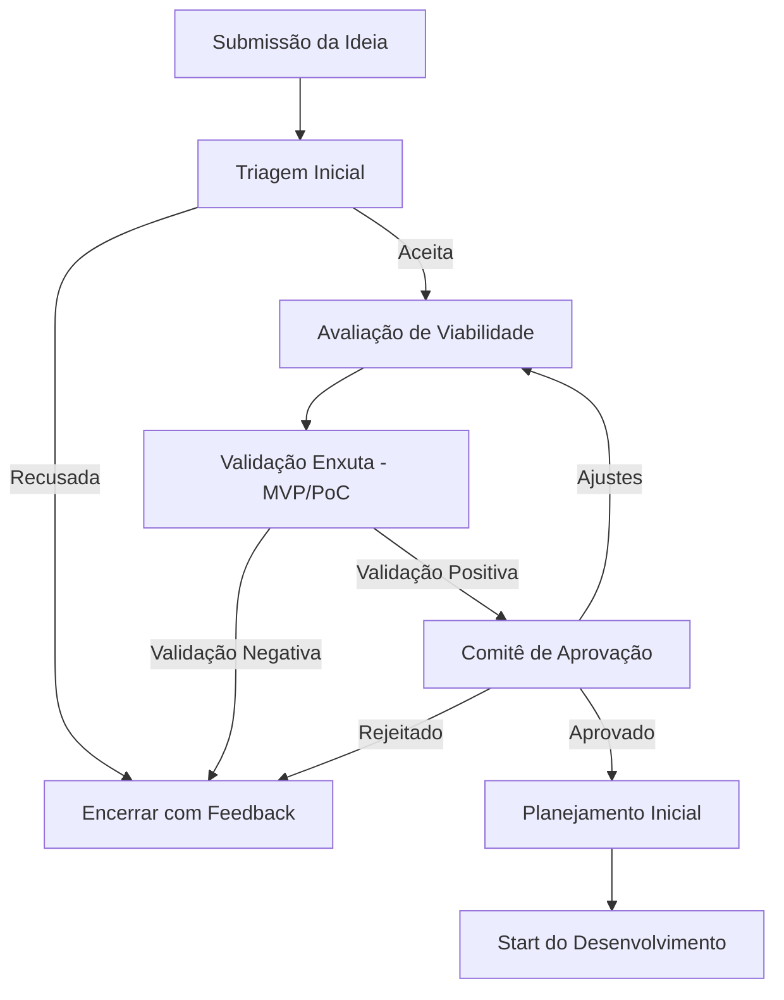

# Fluxo de Trabalho para Propostas e Aprovação de Novos Projetos de Software

Este documento descreve o processo padrão da BT Blue para submissão, avaliação e aprovação de novas ideias e projetos de software. O objetivo é garantir que todas as propostas passem por uma análise estruturada, garantindo alinhamento estratégico, viabilidade e retorno sobre investimento.

---

## **1. Submissão da Ideia**

**Responsável:** Qualquer colaborador ou equipe

**Ações:**

* Preencher formulário padrão com:

  * Título e descrição breve da ideia
  * Problema ou oportunidade que o projeto resolve
  * Público-alvo interno/externo
  * Benefícios esperados
  * Recursos necessários (mínimos)
* Registrar no repositório de ideias (pode ser um quadro Kanban)

---

## **2. Triagem Inicial**

**Responsável:** Comitê de Inovação / TI

**Critérios:**

* Alinhamento com objetivos estratégicos da empresa
* Viabilidade técnica preliminar
* Escopo inicial

**Ações:**

* Marcar como: **Aceito para Avaliação** ou **Recusado com Feedback**
* Caso aceito, criar cartão no quadro de avaliação

---

## **3. Avaliação de Viabilidade**

**Responsável:** Equipe Técnica + Representante de Negócios

**Atividades:**

* Análise de viabilidade técnica
* Estimativa de tempo (utilizando técnicas ágeis de estimativa)
* Estimativa de custo e recursos
* Riscos identificados
* Retorno esperado (ROI)

**Saída:** Documento/Resumo de Viabilidade

---

## **4. Validação Enxuta (MVP ou Prova de Conceito)**

**Responsável:** Equipe de Desenvolvimento

**Objetivo:** Testar hipóteses críticas antes de investir pesado

**Ações:**

* Desenvolver MVP ou protótipo navegável
* Testar com usuários internos ou clientes piloto
* Coletar métricas de uso e feedback

---

## **5. Comitê de Aprovação**

**Responsável:** Diretoria / Gestores

**Critérios para Aprovação:**

* Resultados positivos da validação
* Alinhamento estratégico
* Recursos disponíveis

**Decisão:** **Aprovar**, **Rejeitar** ou **Retornar para Ajustes**

---

## **6. Planejamento Inicial**

**Responsável:** PO + Equipe Técnica

**Ações:**

* Criar backlog inicial
* Definir metas e métricas de sucesso
* Planejar entregas incrementais

---

## **7. Start do Desenvolvimento**

**Responsável:** Equipe de Desenvolvimento

**Ações:**

* Iniciar sprints/iterações
* Monitorar métricas de progresso e qualidade
* Revisar periodicamente para confirmar alinhamento

---

## **Fluxo Visual (Mermaid)**

