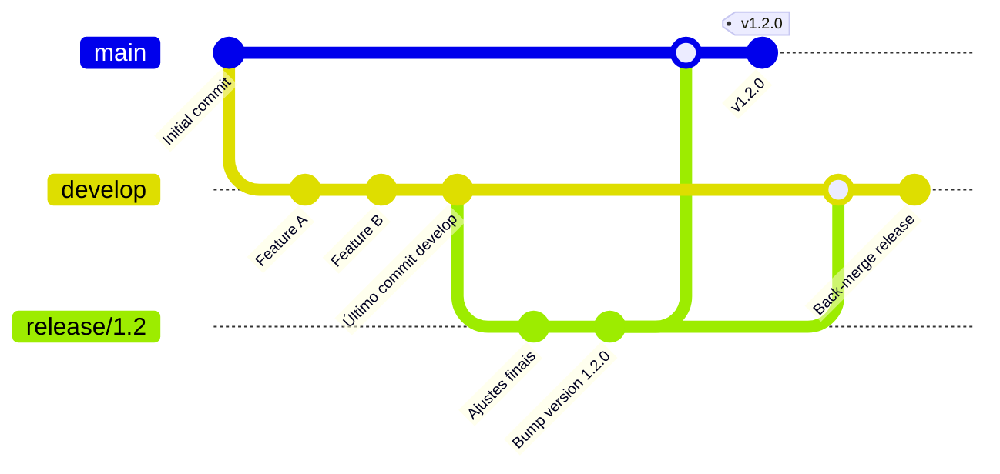
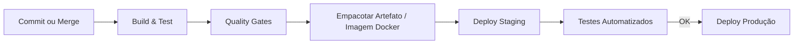
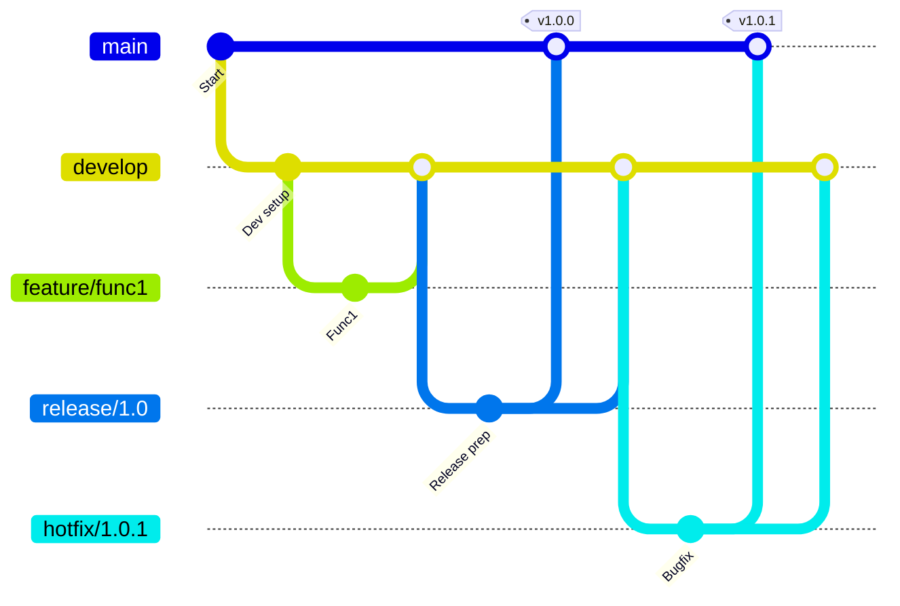

# 📌 Guia de Versionamento e Fluxo de Trabalho — BT Blue

Este documento descreve, de forma **estruturada, detalhada e padronizada**, o **fluxo oficial de versionamento de software** utilizado pela BT Blue.  
O objetivo é garantir **organização, rastreabilidade, qualidade de código** e **consistência nos processos** de desenvolvimento, homologação e produção.

---

## 📂 Estrutura de Branches

O versionamento será baseado em um modelo **GitFlow adaptado** com **Branches Permanentes** e **Branches Temporárias**.

### 1. **Branches Permanentes**
Essas branches são **estáveis** e possuem funções específicas no ciclo de vida do software.

| Branch | Função | Padrão de Nome |
|--------|--------|----------------|
| `main` | Contém o código **em produção**. Cada merge nesta branch é **tagueado** e implantado em produção. | `main` |
| `develop` | Contém a versão **em desenvolvimento**. Serve de base para novas features e releases. | `develop` |

---

### 2. **Branches Temporárias**
Criadas para implementar novas funcionalidades, correções críticas ou preparar versões para homologação.

| Tipo | Função | Padrão de Nome |
|------|--------|----------------|
| **Feature** | Desenvolvimento de novas funcionalidades. Sempre parte de `develop`. | `feature/<nome-curto>` |
| **Release** | Preparação para entrega em homologação. Pode incluir ajustes finais e correções. Parte de `develop` e, ao final, vai para `main` e `develop` (back-merge). | `release/X.Y` |
| **Hotfix** | Correções urgentes em produção. Parte de `main` e, ao final, volta para `main` e `develop` (back-merge). | `hotfix/X.Y.Z` |

---

## 🔄 Fluxo de Trabalho

O processo é dividido em **etapas claras**, garantindo rastreabilidade e qualidade.

### **1. Desenvolvimento de Funcionalidades**


### **2. Preparação para Homologação (Release)**
```mermaid
gitGraph
   commit id: "Último commit develop"
   branch release/1.2
   commit id: "Ajustes finais"
   checkout main
   merge release/1.2 tag: "v1.2.0"
   checkout develop
   merge release/1.2
```

### **3. Correções Urgentes (Hotfix)**
```mermaid
gitGraph
   commit id: "Prod bug"
   branch hotfix/1.2.1
   commit id: "Corrige bug crítico"
   checkout main
   merge hotfix/1.2.1 tag: "v1.2.1"
   checkout develop
   merge hotfix/1.2.1
```

---

## 🚀 Deploy e Ambientes

| Ambiente | Origem | Observações |
|----------|--------|-------------|
| **Staging (Homologação)** | `release/X.Y` | Somente correções são aplicadas após a criação da release. |
| **Produção** | `main` | Deploy imediato após merge + tag. |

---

## 🏗 CI/CD e Automação

Fluxo padrão:
1. **Build & Testes**
2. **Quality Gates** (SonarQube, GAST, Linters, etc.)
3. **Package Artifact / Docker Image**
4. **Deploy Automático**
5. **Testes Automatizados no Ambiente**



---

## 🏷 Convenção de Versionamento
**Semantic Versioning:**
```
MAJOR.MINOR.PATCH
```
- **MAJOR (X)** → Alterações incompatíveis.
- **MINOR (Y)** → Novas funcionalidades compatíveis.
- **PATCH (Z)** → Correções de bugs.

---

## 📌 Resumo Visual do Fluxo Geral


