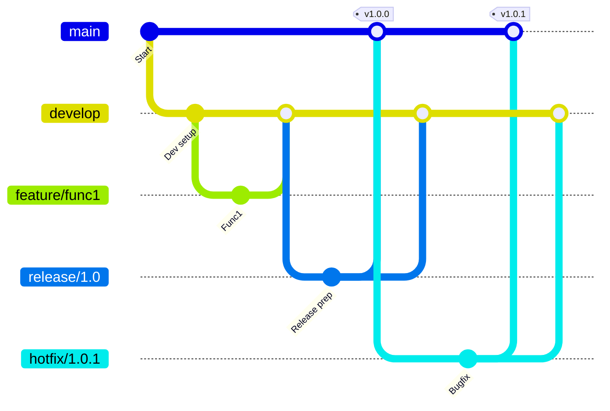

# BT BLUE

<div align="center">
  <h3>🏛️ Antecipação de Créditos Trabalhistas com Tecnologia de Ponta</h3>
  <p><em>Transparência, velocidade e inovação para o futuro do crédito judicial</em></p>
</div>

## 📂 Estrutura de Branches

O versionamento será baseado em um modelo **GitFlow adaptado** com **Branches Permanentes** e **Branches Temporárias**.

### 1. **Branches Permanentes**
Essas branches são **estáveis** e possuem funções específicas no ciclo de vida do software.

| Branch | Função | Padrão de Nome |
|--------|--------|----------------|
| `main` | Contém o código **em produção**. Cada merge nesta branch é **tagueado** e implantado em produção. | `main` |
| `develop` | Contém a versão **em desenvolvimento**. Serve de base para novas features e releases. | `develop` |

---

### 2. **Branches Temporárias**
Criadas para implementar novas funcionalidades, correções críticas ou preparar versões para homologação.

| Tipo | Função | Padrão de Nome |
|------|--------|----------------|
| **Feature** | Desenvolvimento de novas funcionalidades. Sempre parte de `develop`. | `feature/<nome-curto>` |
| **Release** | Preparação para entrega em homologação. Pode incluir ajustes finais e correções. Parte de `develop` e, ao final, vai para `main` e `develop` (back-merge). | `release/X.Y` |
| **Hotfix** | Correções urgentes em produção. Parte de `main` e, ao final, volta para `main` e `develop` (back-merge). | `hotfix/X.Y.Z` |

---

## 🔄 Fluxo de Trabalho

O processo é dividido em **etapas claras**, garantindo rastreabilidade e qualidade.

### **1. Desenvolvimento de Funcionalidades**

```mermaid
gitGraph
    commit id: "Initial commit"
    branch develop
    checkout develop
    commit id: "Início develop"
    branch feature/minha-func
    checkout feature/minha-func
    commit id: "Implementa função"
    commit id: "Testa função"
    checkout develop
    merge feature/minha-func
```


### **2. Preparação para Homologação (Release)**

```mermaid
gitGraph
    commit id: "Início"
    branch develop
    checkout develop
    commit id: "Último commit develop"
    branch release/1.2
    commit id: "Ajustes finais"
    checkout main
    merge release/1.2 tag: "v1.2.0"
    checkout develop
    merge release/1.2
```


### **3. Correções Urgentes (Hotfix)**

```mermaid
gitGraph
    commit id: "v1.2.0"
    branch develop
    checkout develop
    commit id: "New features"
    checkout main
    commit id: "Prod bug"
    branch hotfix/1.2.1
    checkout hotfix/1.2.1
    commit id: "Corrige bug crítico"
    checkout main
    merge hotfix/1.2.1 tag: "v1.2.1"
    checkout develop
    merge hotfix/1.2.1
```


---

## 🚀 Deploy e Ambientes

| Ambiente | Origem | Observações |
|----------|--------|-------------|
| **Staging (Homologação)** | `release/X.Y` | Somente correções são aplicadas após a criação da release. |
| **Produção** | `main` | Deploy imediato após merge + tag. |

---

## 🏗 CI/CD e Automação

Fluxo padrão:
1. **Build & Testes**
2. **Quality Gates** (SonarQube, GAST, Linters, etc.)
3. **Package Artifact / Docker Image**
4. **Deploy Automático**
5. **Testes Automatizados no Ambiente**

```mermaid
flowchart LR
    A[Commit ou Merge] --> B[Build & Test]
    B --> C[Quality Gates]
    C --> D[Empacotar Artefato / Imagem Docker]
    D --> E[Deploy Staging]
    E --> F[Testes Automatizados]
    F -->|OK| G[Deploy Produção]
```



---

## 🏷 Convenção de Versionamento
**Semantic Versioning:**
```
MAJOR.MINOR.PATCH
```
- **MAJOR (X)** → Alterações incompatíveis.
- **MINOR (Y)** → Novas funcionalidades compatíveis.
- **PATCH (Z)** → Correções de bugs.

---

## 📌 Resumo Visual do Fluxo Geral



